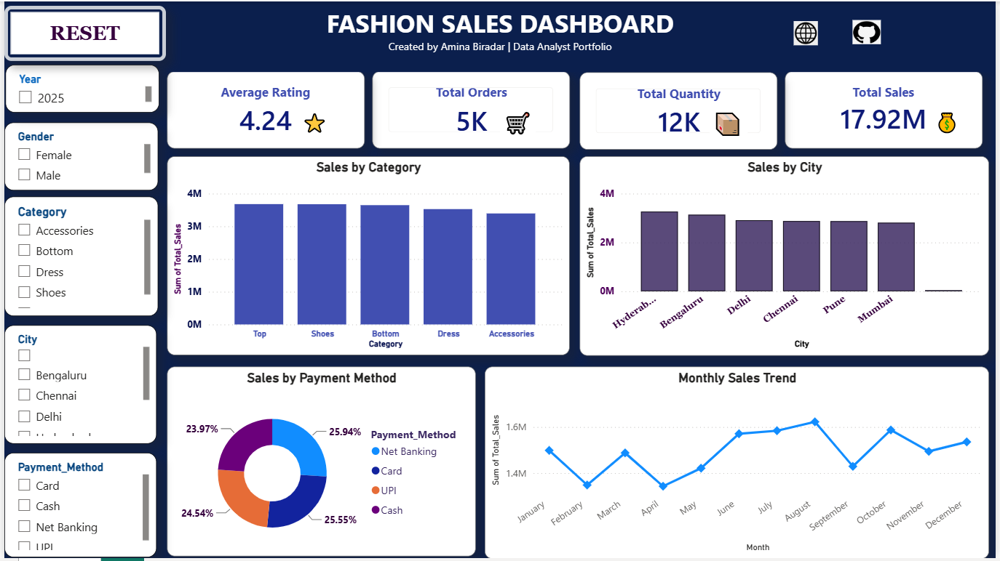

  

# Fashion Sales Dashboard | Power BI

An interactive Power BI dashboard for analyzing fashion sales performance, customer behavior, payment trends, and city-wise sales insights.

## Project Overview

This project transforms raw fashion retail data into an interactive business intelligence dashboard using Power BI. It helps identify sales trends, top-performing product categories, customer preferences, and monthly business performance through dynamic visualizations and KPIs.

## Tools & Technologies

- Power BI
- DAX (Data Analysis Expressions)
- Microsoft Excel / CSV
- Data Visualization

## Key KPIs

| KPI | Value |
|------|------:|
| **Total Sales** | **17.92M** |
| **Total Orders** | **5K** |
| **Total Quantity** | **12K** |
| **Average Rating** | **4.24 ⭐** |

## Dashboard Features

- Interactive slicers (Year, Gender, Category, City, and Payment Method)
- Sales by Category Analysis
- City-wise Sales Performance
- Payment Method Distribution
- Monthly Sales Trend
- Dynamic KPI Cards

## Business Insights

- Hyderabad generated the highest overall sales.
- Shoes were among the top-performing product categories.
- Card and Net Banking were the most preferred payment methods.
- Monthly sales peaked during the mid-year period.

## Repository Files

- `Fashion-Sales-Dashboard.pbix` — Power BI dashboard
- `fashion_sales.csv` — Source dataset
- `dashboard.png` — Dashboard preview

## Author

**Amina Biradar**  
Aspiring Data Analyst | Pune, India
